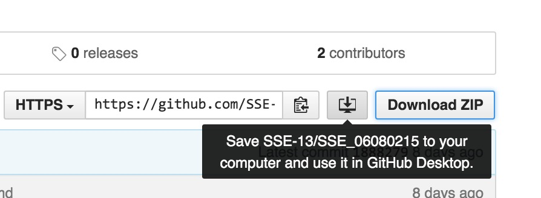
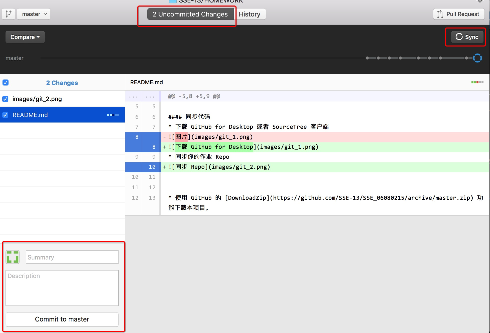

# 如何完成作业

## 准备工作


#### 软件下载
* 下载并安装 Node.js
* 下载 GitHub for Desktop 或者 SourceTree 客户端
* 下载并安装 Visual Studio Code 客户端

#### 同步代码
* 将 GitHub 中的项目```SSE_${学号})```同步到本地

* 使用 VisualStudioCode 打开本地项目文件夹 （ File - Open Folder )
* 随意修改 README.md 文件，并提交回 GitHub，并在 Github网站上确认提交成功


> 在 Github for Desktop 中，先进行 commit ，再进行 sync
> 在 SourceTree 中，先进行 commit ，再进行 push


## 作业内容


### 作业一
  
* 编写一段自我介绍，位于 ```README.md``` 中
  * 必须使用 Markdown 语法，至少包括
    * 段落符
    * 代码片段
    * 粗体
    * 文字链接

### 作业二

#### 准备作业
* 使用 GitHub 的 [DownloadZip](https://github.com/SSE-13/SSE_06080215/archive/master.zip) 功能下载本项目。
* 解压本项目，将 ``` canvas_oop ``` , ```package.json```,```start.js```和```.gitignore```解压到作业项目的根目录下。
* 打开命令行，进入作业项目根目录，执行 ``` npm install ```
* 执行 ``` node start.js canvas_oop ```，启动一个HTTP服务器
* 打开 Chrome浏览器，输入 ```localhost:3000```，如果能看到内容，表示准备工作完成
* 在整个开发过程中，请不要关闭命令行，以保证服务器一直处于开启状态

#### 作业内容
* 在 ```canvas_oop```文件夹中创建一个新的 ```README.md``` 文件，并在其中上传一张任意 2D 游戏的截图。
* 修改 ```canvas_oop``` 文件夹中的 ```.ts```文件，编写逻辑，绘制简单的游戏画面（可以很粗糙），实现上述游戏的静态画面。
* 注意，不要修改任何的 ```.js ```文件

#### 注意事项
* 必须使用 Bitmap , TextField 等类，并修改其实现，完善其可扩展性，如 TextField 的自定义文字内容等功能。
* 不允许直接把游戏截图作为一个 Bitmap 使用，必须进行分层渲染，如：游戏场景、游戏人物、游戏界面。
* 完成后的项目结构应该如下：
```
project-path
    |-- canvas_oop
        |-- README.md // 作业2的Markdown文件（游戏截图）
        |-- canvas-oop.ts // 作业2源代码
        |-- 其他文件 
    |-- node_modules // 此文件夹不会被提交到GitHub
    |-- .gitignore // git忽略列表
    |-- start.js // 启动服务器脚本
    |-- README.md // 作业1的Markdown文件（自我介绍）
```


### 作业三

#### 准备作业
* 使用 GitHub 的 [DownloadZip](https://github.com/SSE-13/SSE_06080215/archive/master.zip) 功能下载本项目。
* 解压本项目，将 ``` animation ``` 解压到作业项目的根目录下。
* 打开命令行，进入作业项目根目录
* 执行 ``` node start.js animation ```，启动一个HTTP服务器
* 打开 Chrome浏览器，输入 ```localhost:3000```，如果能看到内容，表示准备工作完成
* 在整个开发过程中，请不要关闭命令行，以保证服务器一直处于开启状态

#### 作业内容
* 修改 ``` animation ``` 文件夹中的 ```animation.ts```文件，为砖块动画添加左侧、右侧的反弹动画逻辑。
* 修改 ``` body ``` 的初始物理量，保证 vx , vy 在 0 至 100 的范围内，行为正常不会越界。
* 最终效果为，砖块会在 （0，0，400，400）的区间内反弹移动，并逐渐静止下来
* 加分题：进一步思考，如何引入摩擦力，使砖块在地面上滑行时逐步减速？
* 作业完成后，请在最后一次提交的提交日志中书写 ```Finish Homework 3``` 字样（注意大小写，空格）

### 作业四

#### 准备作业
* 使用 GitHub 的 [DownloadZip](https://github.com/SSE-13/SSE_06080215/archive/master.zip) 功能下载本项目。
* 解压本项目，将 ``` findpath ``` 解压到作业项目的根目录下。
* 打开命令行，进入作业项目根目录
* 执行 ``` node start.js findpath ```，启动一个HTTP服务器
* 打开 Chrome浏览器，输入 ```localhost:3000```，如果能看到内容，表示准备工作完成
* 在整个开发过程中，请不要关闭命令行，以保证服务器一直处于开启状态

#### 作业内容
* 修改 ``` findpath ``` 文件夹中的 ```game.ts``` 文件
    * 将地图的不可走区域设置为黑色
    * 根据 astar 的寻路结果，编写人物行走动画，让人物逐个走过网格，到达终点
* 加分题：将人物行走动画从“折线”调整为“平滑曲线”
* 作业完成后，请在最后一次提交的提交日志中书写 ```Finish Homework 4``` 字样（注意大小写，空格）


### 作业五

#### 准备作业

* 同作业四，目录为 ``` displaylist ```

#### 作业内容

* 分析 ```displaylist``` 中的 ``` renderer.ts ``` 文件，补全 TODO 注释相关的内容，实现一个完整的显示列表
* 编写一个人物图像，必须包含以下显示列表结构
```
- Container ( human )
|-- Bitmap ( head )
|-- Bitmap ( trunk )
|-- Bitmap ( left_leg )
|-- Bitmap ( right_leg )
|-- Bitmap ( left_arm )
|-- Bitmap ( right_arm )
```

* 让这个人物整体进行平移和旋转，形成“滚动式前进”
* 注意滚动的锚点应该在人的中心
* 作业完成后，请在最后一次提交的提交日志中书写 ```Finish Homework 5``` 字样（注意大小写，空格）


### 作业六

#### 准备作业

* 同作业五，目录为 ``` mouseevent ```
* 把作业五中的素材，坐标代码，滚动前进等逻辑复制到作业六中，形成一个完整的小人

#### 作业内容

* 分析 ```events.ts```中的代码逻辑
* 修改 ```game.ts```中的hitTest函数，实现以下功能：
    * 点击小人的头部会使其反向滚动前进
    * 点击小人腿部（两条腿）会使其立刻原地站立
    * 站立之后再点击头部继续滚动前进
* 作业完成后，请在最后一次提交的提交日志中书写 ```Finish Homework 6``` 字样（注意大小写，空格）

### 作业七

#### 准备作业
* 执行 ```node -v```命令，确认你的 Node.js 版本 >= v4.0.0
* 使用 GitHub 的 [DownloadZip](https://github.com/SSE-13/SSE_06080215/archive/master.zip) 功能下载项目。
* 解压本项目，将 ``` map_editor ``` , ```.gitignore```,```start.js``` 解压到作业项目的根目录下。
* 执行 ```node start.js map_editor```，会提示 Electron 不存在
* 在 Electron[源代码网站](https://github.com/electron/electron) 下载符合你操作系统的 electron-v0.37.4 版本。
* 下载并解压 electron 到正确目录上，再次执行 ``` node start.js map_editor ```，确认可以正确的打开 Electron
* 用 VSCode 打开 map_editor 文件夹，修改 ``` src ``` 中的TypeScript代码，会发现代码会进行自动编译，如果编译错误的话，命令行中会有报错信息。
* 修改完代码后，在 Electron 中，按下 F5 （ Windows ） 或者 Command + R 键（Mac），会自动刷新 Electron，修改会生效
* 在保证上述内容完全正常的前提下再做作业，如果出现了问题，请同学之间相互询问，或者周日答疑。
* 在提交代码前确认已经修改了 .gitignore 文件，添加 node_modules 和 electron-v*，以保证 node_modules 文件夹和 electron 文件夹不会被提交（因为体积很大，提交很慢）
* 如果已经误将 electron 文件夹提交了，请修改 .gitignore 文件并再次提交一次，就可以清除 electron

#### 作业内容：

* 实现以下功能：
    * 通过 map.json 的配置信息，读取网格数据，并将可走网格标记为蓝色，不可走网格标记为红色。
    * 点击任意一个网格，修改其可走状态（将可走修改为不可走，将不可走修改为可走）。
    * 创建一个名为“保存”的按钮，将配置文件保存到 map.json 中。
* 作业完成后，请在最后一次提交的提交日志中书写 ```Finish Homework 7``` 字样（注意大小写，空格）

#### 知识点：
* 参考 ``` readFile ``` 函数实现 ```writeFile ```
    * 使用 ```JSON.stringify```进行反序列化
    * 使用 ``` fs.writeFileSync ``` 进行文件存储


#### 附加题
 * 创建一个名为“撤销”的按钮，可以撤销上一步的选项。
 * 如果修改了多次，可以无限撤销，直到返回编辑器打开之后的初始状态。
 * 率先完成附加作业的同学会在课后得到神秘小奖品一份。
